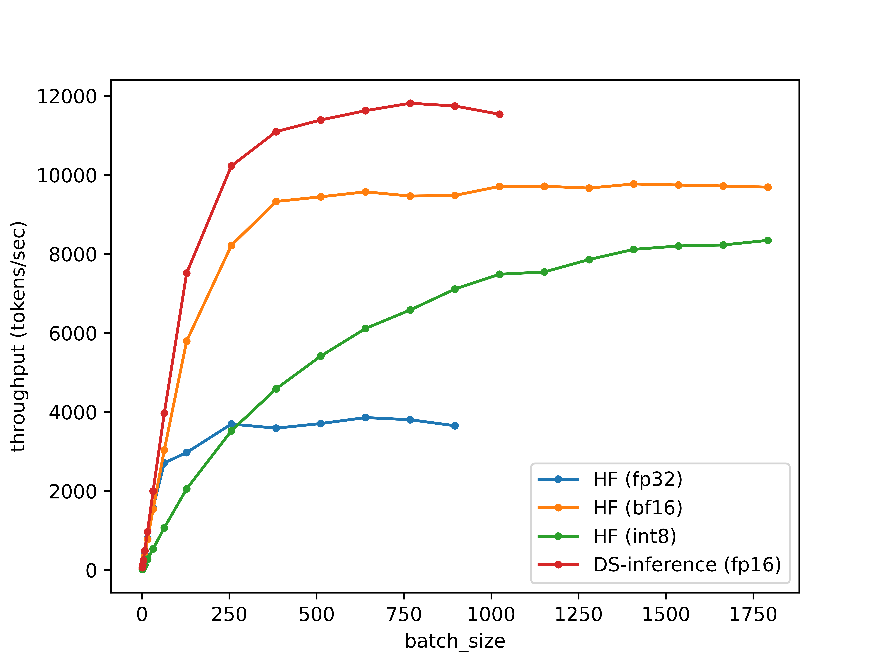
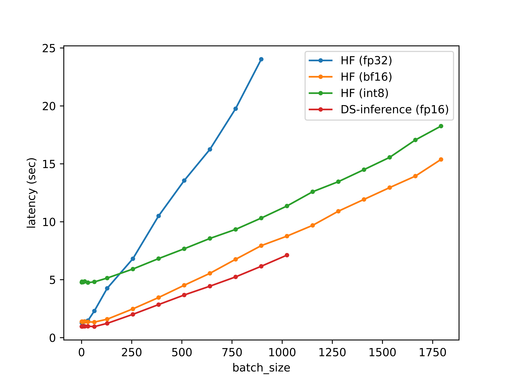
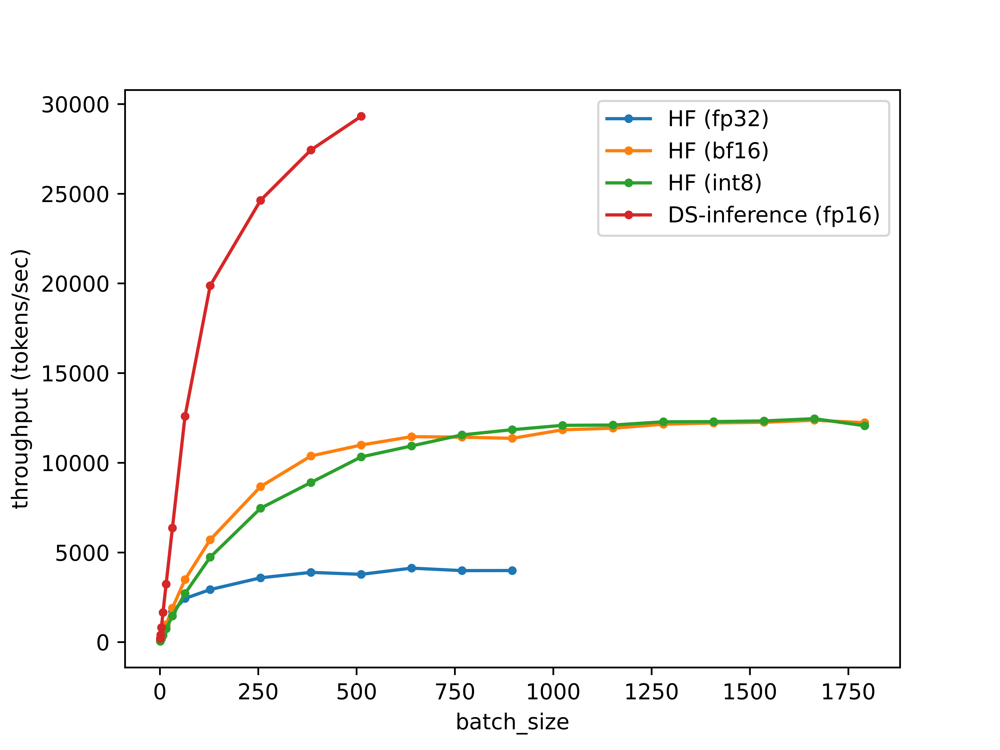
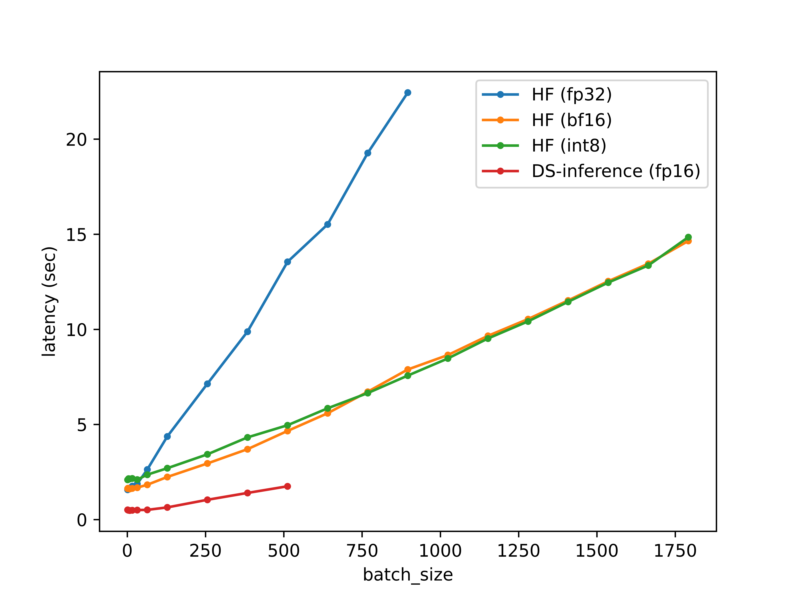

# bigcode-inference-benchmark
A100 80GB

## BLOOM
```python
hidden_size = 2048
n_head = 16
n_layer = 24
total_params = 1311535104
```




Throughput (tokens/sec | msec/token)
| batch_size |    HF (fp32)    |    HF (bf16)     |    HF (int8)    | DS-inference (fp16) |
|:----------:|:---------------:|:----------------:|:---------------:|:-------------------:|
| 1          | 77.94 \| 12.83  | 72.50 \| 13.79   | 20.94 \| 47.75  | 104.00 \| 9.62      |
| 2          | 155.77 \| 6.42  | 143.44 \| 6.97   | 41.44 \| 24.13  | 206.33 \| 4.85      |
| 4          | 319.15 \| 3.13  | 293.06 \| 3.41   | 83.02 \| 12.04  | 418.28 \| 2.39      |
| 8          | 596.68 \| 1.68  | 581.10 \| 1.72   | 167.03 \| 5.99  | 828.67 \| 1.21      |
| 16         | 1146.25 \| 0.87 | 1147.91 \| 0.87  | 330.12 \| 3.03  | 1652.51 \| 0.61     |
| 32         | 2177.47 \| 0.46 | 2356.71 \| 0.42  | 673.33 \| 1.49  | 3280.17 \| 0.30     |
| 64         | 2776.93 \| 0.36 | 4784.46 \| 0.21  | 1329.42 \| 0.75 | 6717.77 \| 0.15     |
| 128        | 3007.26 \| 0.33 | 8056.59 \| 0.12  | 2491.86 \| 0.40 | 10410.82 \| 0.10    |
| 256        | 3758.11 \| 0.27 | 10339.00 \| 0.10 | 4325.98 \| 0.23 | 12707.62 \| 0.08    |
| 384        | 3658.51 \| 0.27 | 11091.67 \| 0.09 | 5628.15 \| 0.18 | 13483.54 \| 0.07    |
| 512        | 3775.92 \| 0.26 | 11332.58 \| 0.09 | 6675.52 \| 0.15 | 13930.89 \| 0.07    |
| 640        | 3938.85 \| 0.25 | 11534.74 \| 0.09 | 7472.39 \| 0.13 | 14399.86 \| 0.07    |
| 768        | 3886.59 \| 0.26 | 11354.37 \| 0.09 | 8220.54 \| 0.12 | 14656.84 \| 0.07    |
| 896        | 3728.33 \| 0.27 | 11286.69 \| 0.09 | 8686.16 \| 0.12 | 14540.19 \| 0.07    |
| 1024       | oom             | 11692.32 \| 0.09 | 9012.79 \| 0.11 | 14390.77 \| 0.07    |
| 1152       | oom             | 11894.50 \| 0.08 | 9147.50 \| 0.11 | oom                 |
| 1280       | oom             | 11731.85 \| 0.09 | 9507.04 \| 0.11 | oom                 |
| 1408       | oom             | 11802.63 \| 0.08 | 9711.69 \| 0.10 | oom                 |
| 1536       | oom             | 11857.12 \| 0.08 | 9873.34 \| 0.10 | oom                 |
| 1664       | oom             | 11932.68 \| 0.08 | 9756.13 \| 0.10 | oom                 |
| 1792       | oom             | 11653.63 \| 0.09 | 9814.68 \| 0.10 | oom                 |
| 1920       | oom             | oom              | oom             | oom                 |

Latency (sec)
| batch_size | HF (fp32) | HF (bf16) | HF (int8) | DS-inference (fp16) |
|:----------:|:---------:|:---------:|:---------:|:-------------------:|
| 1          | 1.28      | 1.38      | 4.77      | 0.96                |
| 2          | 1.28      | 1.39      | 4.83      | 0.97                |
| 4          | 1.25      | 1.36      | 4.82      | 0.96                |
| 8          | 1.34      | 1.38      | 4.79      | 0.97                |
| 16         | 1.40      | 1.39      | 4.85      | 0.97                |
| 32         | 1.47      | 1.36      | 4.75      | 0.98                |
| 64         | 2.30      | 1.34      | 4.81      | 0.95                |
| 128        | 4.26      | 1.59      | 5.14      | 1.23                |
| 256        | 6.81      | 2.48      | 5.92      | 2.01                |
| 384        | 10.50     | 3.46      | 6.82      | 2.85                |
| 512        | 13.56     | 4.52      | 7.67      | 3.68                |
| 640        | 16.25     | 5.55      | 8.56      | 4.44                |
| 768        | 19.76     | 6.76      | 9.34      | 5.24                |
| 896        | 24.03     | 7.94      | 10.32     | 6.16                |
| 1024       | oom       | 8.76      | 11.36     | 7.12                |
| 1152       | oom       | 9.69      | 12.59     | oom                 |
| 1280       | oom       | 10.91     | 13.46     | oom                 |
| 1408       | oom       | 11.93     | 14.50     | oom                 |
| 1536       | oom       | 12.95     | 15.56     | oom                 |
| 1664       | oom       | 13.94     | 17.06     | oom                 |
| 1792       | oom       | 15.38     | 18.26     | oom                 |
| 1920       | oom       | oom       | oom       | oom                 |

## GPT2 Multi-Head Attention
```python
hidden_size = 2048
n_head = 16
n_layer = 24
total_params = 1315725312
```




Throughput (tokens/sec | msec/token)
| batch_size |    HF (fp32)    |    HF (bf16)     |    HF (int8)     | DS-inference (fp16) |
|:----------:|:---------------:|:----------------:|:----------------:|:-------------------:|
| 1          | 63.55 \| 15.73  | 61.24 \| 16.33   | 47.77 \| 20.93   | 196.14 \| 5.10      |
| 2          | 124.17 \| 8.05  | 121.47 \| 8.23   | 95.23 \| 10.50   | 399.42 \| 2.50      |
| 4          | 248.62 \| 4.02  | 243.92 \| 4.10   | 186.14 \| 5.37   | 809.35 \| 1.24      |
| 8          | 481.43 \| 2.08  | 496.29 \| 2.01   | 374.49 \| 2.67   | 1651.31 \| 0.61     |
| 16         | 907.02 \| 1.10  | 973.43 \| 1.03   | 742.21 \| 1.35   | 3234.25 \| 0.31     |
| 32         | 1706.28 \| 0.59 | 1900.97 \| 0.53  | 1454.42 \| 0.69  | 6360.31 \| 0.16     |
| 64         | 2433.37 \| 0.41 | 3489.45 \| 0.29  | 2707.92 \| 0.37  | 12591.66 \| 0.08    |
| 128        | 2930.07 \| 0.34 | 5709.92 \| 0.18  | 4732.49 \| 0.21  | 19875.11 \| 0.05    |
| 256        | 3584.40 \| 0.28 | 8668.65 \| 0.12  | 7462.20 \| 0.13  | 24630.32 \| 0.04    |
| 384        | 3888.22 \| 0.26 | 10376.45 \| 0.10 | 8898.32 \| 0.11  | 27435.64 \| 0.04    |
| 512        | 3778.97 \| 0.26 | 10988.53 \| 0.09 | 10325.84 \| 0.10 | 29318.43 \| 0.03    |
| 640        | 4124.22 \| 0.24 | 11454.54 \| 0.09 | 10937.53 \| 0.09 | oom                 |
| 768        | 3986.02 \| 0.25 | 11427.95 \| 0.09 | 11552.58 \| 0.09 | oom                 |
| 896        | 3990.40 \| 0.25 | 11360.73 \| 0.09 | 11842.71 \| 0.08 | oom                 |
| 1024       | oom             | 11837.35 \| 0.09 | 12085.76 \| 0.08 | oom                 |
| 1152       | oom             | 11926.65 \| 0.08 | 12101.75 \| 0.08 | oom                 |
| 1280       | oom             | 12149.19 \| 0.08 | 12282.53 \| 0.08 | oom                 |
| 1408       | oom             | 12220.05 \| 0.08 | 12294.24 \| 0.08 | oom                 |
| 1536       | oom             | 12255.80 \| 0.08 | 12331.86 \| 0.08 | oom                 |
| 1664       | oom             | 12369.72 \| 0.08 | 12456.47 \| 0.08 | oom                 |
| 1792       | oom             | 12234.69 \| 0.08 | 12063.65 \| 0.08 | oom                 |
| 1920       | oom             | oom              | oom              | oom                 |

Latency (sec)
| batch_size | HF (fp32) | HF (bf16) | HF (int8) | DS-inference (fp16) |
|:----------:|:---------:|:---------:|:---------:|:-------------------:|
| 1          | 1.57      | 1.63      | 2.09      | 0.51                |
| 2          | 1.61      | 1.65      | 2.10      | 0.50                |
| 4          | 1.61      | 1.64      | 2.15      | 0.49                |
| 8          | 1.66      | 1.61      | 2.14      | 0.48                |
| 16         | 1.76      | 1.64      | 2.16      | 0.49                |
| 32         | 1.88      | 1.68      | 2.10      | 0.50                |
| 64         | 2.63      | 1.83      | 2.36      | 0.51                |
| 128        | 4.37      | 2.24      | 2.70      | 0.64                |
| 256        | 7.14      | 2.95      | 3.43      | 1.04                |
| 384        | 9.88      | 3.70      | 4.32      | 1.40                |
| 512        | 13.55     | 4.66      | 4.96      | 1.75                |
| 640        | 15.52     | 5.59      | 5.85      | oom                 |
| 768        | 19.27     | 6.72      | 6.65      | oom                 |
| 896        | 22.45     | 7.89      | 7.57      | oom                 |
| 1024       | oom       | 8.65      | 8.47      | oom                 |
| 1152       | oom       | 9.66      | 9.52      | oom                 |
| 1280       | oom       | 10.54     | 10.42     | oom                 |
| 1408       | oom       | 11.52     | 11.45     | oom                 |
| 1536       | oom       | 12.53     | 12.46     | oom                 |
| 1664       | oom       | 13.45     | 13.36     | oom                 |
| 1792       | oom       | 14.65     | 14.85     | oom                 |
| 1920       | oom       | oom       | oom       | oom                 |
